# Relatório da Sistematização (PostGame Stats)
 
**Aluna:** Maria Clara Canuto Gontijo
**Matrícula:** 72601725
 
---
 
## 1. Dataset e Justificativa
 
Escolhi o dataset **"Video Game Sales with Ratings"** por interesse pessoal no tema, jogos eletrônicos, e porque ele atendia bem aos requisitos do trabalho: mais de 1.000 registros (~16.700 jogos), com múltiplas variáveis numéricas (vendas por região, nota da crítica, nota dos usuários) e categóricas (plataforma, gênero, publicadora), permitindo explorar todos os módulos pedidos de forma natural.
 
---
 
## 2. Decisões de Implementação do Núcleo Estatístico
 
### Validação dos dados (`_validate`)
 
Todas as funções do núcleo estatístico passam por uma validação central que verifica se a lista de dados está vazia, lançando `ValueError` nesse caso. Optei por não validar explicitamente o caso de `dados=None`, já que, na aplicação, os dados sempre vêm de uma coluna real do dataset (via `df[coluna].dropna().tolist()`) — não há cenário no fluxo do app onde `None` seria passado diretamente para essas funções.
 
### Variância e Desvio Padrão — Amostral vs. Populacional
 
Implementei as duas versões, controladas por um parâmetro `amostral: bool = True`. A diferença está no divisor: a variância populacional divide a soma dos quadrados dos desvios por `n`, enquanto a amostral divide por `n-1` (correção de Bessel). Essa correção existe porque, ao usar apenas uma amostra dos dados para estimar a variância de um universo maior, dividir por `n` tende a subestimar a variabilidade real — uma amostra, por definição, tende a não capturar os valores mais extremos da população completa. Dividir por `n-1` corrige esse viés, resultando em uma estimativa ligeiramente maior e mais próxima da variância real da população.
 
No contexto deste projeto, como o dataset representa uma amostra de jogos (não "todos os jogos que existem"), a versão amostral é a mais utilizada por padrão na aplicação.
 
### Fórmulas Matemáticas
 
**Média**
$$\bar{x} = \frac{\sum_{i=1}^{n} x_i}{n}$$
 
**Mediana**
Valor central da amostra ordenada; se `n` for par, a média dos dois valores centrais.
 
**Moda**
Valor(es) de maior frequência (suporta multimodalidade).
 
**Amplitude**
$$A = x_{max} - x_{min}$$
 
**Variância** (amostral e populacional)
$$s^2_{amostral} = \frac{\sum_{i=1}^{n}(x_i - \bar{x})^2}{n-1} \qquad \sigma^2_{pop} = \frac{\sum_{i=1}^{n}(x_i - \bar{x})^2}{n}$$
 
**Desvio Padrão**
$$s = \sqrt{s^2}$$
 
**Percentil** (interpolação linear)
$$posição = \frac{p}{100}(n-1)$$
Interpolação entre os valores ordenados adjacentes a essa posição.
 
**IQR**
$$IQR = Q_3 - Q_1$$
 
**Coeficiente de Variação**
$$CV = \frac{s}{\bar{x}}$$
 
**Covariância**
$$cov(x,y) = \frac{\sum_{i=1}^{n}(x_i - \bar{x})(y_i - \bar{y})}{n-1}$$
 
**Correlação de Pearson**
$$r = \frac{cov(x,y)}{s_x \cdot s_y}$$
 
**Detecção de Outliers (regra do IQR)**
$$x_i \text{ é outlier se } x_i < Q_1 - 1.5 \cdot IQR \text{ ou } x_i > Q_3 + 1.5 \cdot IQR$$
 
**Regra de Sturges**
$$k = 1 + \log_2(n)$$
 
**Regressão Linear Simples (mínimos quadrados)**
$$b = \frac{cov(x,y)}{var(x)} \qquad a = \bar{y} - b\bar{x} \qquad R^2 = r^2$$
 
**PDF Normal**
$$f(x) = \frac{1}{\sigma\sqrt{2\pi}} e^{-\frac{(x-\mu)^2}{2\sigma^2}}$$
 
**PDF Exponencial**
$$f(x) = \lambda e^{-\lambda x}, \quad x \geq 0, \quad \lambda = \frac{1}{\bar{x}}$$
 
---
 
## 3. Resultados da Validação Contra as Bibliotecas
 
Todas as funções do núcleo estatístico próprio foram validadas por meio de **36 testes automatizados** (pytest), comparando os resultados com implementações de referência do **NumPy** e **SciPy** (`np.mean`, `np.median`, `np.var`, `np.std`, `np.percentile`, `np.cov`, `scipy.stats.pearsonr`, `scipy.stats.linregress`, entre outras).
 
A tolerância numérica utilizada na maioria das comparações foi de **1e-6** (diferença absoluta), adequada para lidar com imprecisões de ponto flutuante sem mascarar erros reais de implementação. Casos de erro esperado (ex.: lista vazia, variância amostral com um único elemento, tamanhos incompatíveis em covariância/regressão) também foram testados com `pytest.raises(ValueError)`.
 
**Resultado final: 36/36 testes passando.**
 
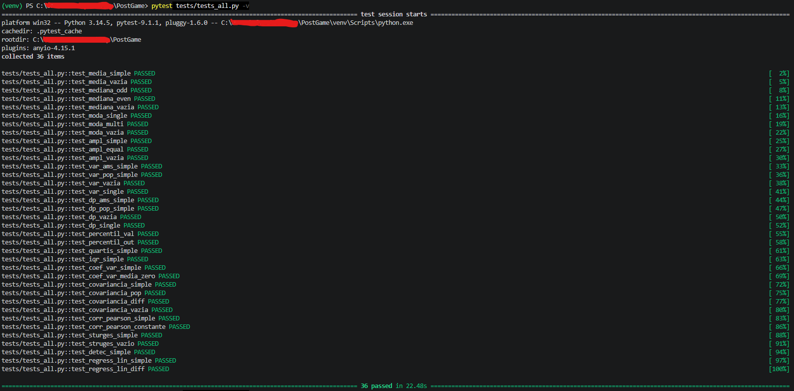
 
---
 
## 4. Módulos da Aplicação
 
### Módulo 0: Dados Reais
 
Carregamento do dataset "Video Game Sales with Ratings" (~16.700 registros) via `pandas`, com tratamento da coluna `User_Score` (originalmente texto, devido a valores `"tbd"`), convertida para numérica com `pd.to_numeric(errors='coerce')`. A aplicação exibe o formato do dataset (linhas × colunas) e a separação automática entre colunas numéricas e categóricas.
 
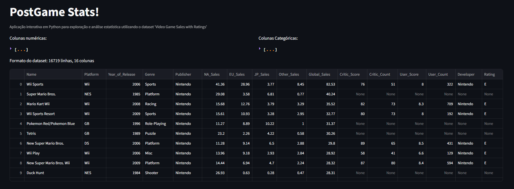
 
### Módulo 1: Núcleo Estatístico Próprio
 
Biblioteca `minhastats`, implementada do zero em `desc.py` e `regress.py`, sem uso de funções prontas de estatística. Inclui média, mediana, moda, amplitude, variância/desvio padrão (amostral e populacional), percentis/quartis, IQR, coeficiente de variação, covariância, correlação de Pearson, detecção de outliers, regra de Sturges e PDFs (Normal e Exponencial). Validada por 36 testes automatizados contra NumPy/SciPy (detalhes na seção 3).
 
### Módulo 2: Estatística Descritiva Interativa
 
O usuário escolhe qualquer variável do dataset em um seletor. Para variáveis numéricas, a aplicação exibe: tabela de frequências por classes (número de classes definido pela regra de Sturges), medidas estatísticas (média, mediana, moda, desvio padrão, variância, quartis, amplitude), detecção de outliers pela regra do IQR, interpretação textual automática da assimetria (comparando média e mediana), histograma e boxplot. Para variáveis categóricas: tabela de frequências, gráfico de barras e gráfico de pizza (limitados às categorias mais frequentes, agrupando o restante em "Outros").
 
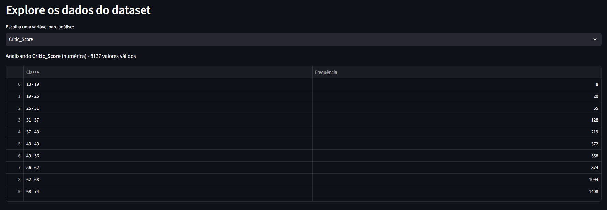
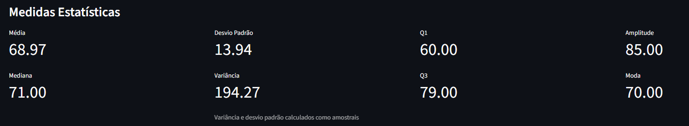
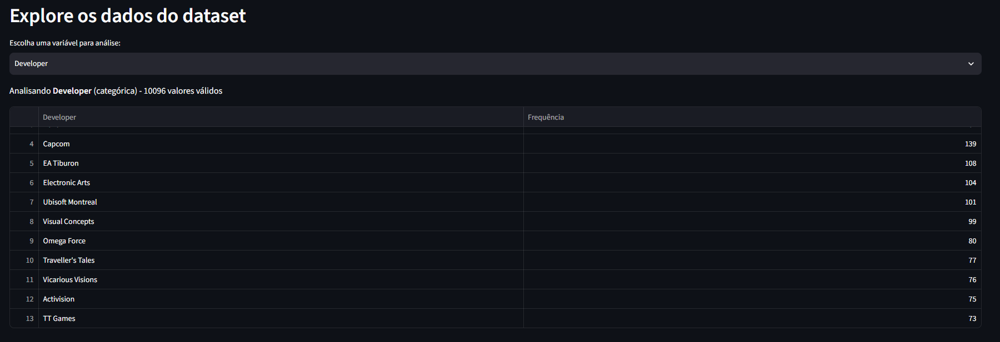
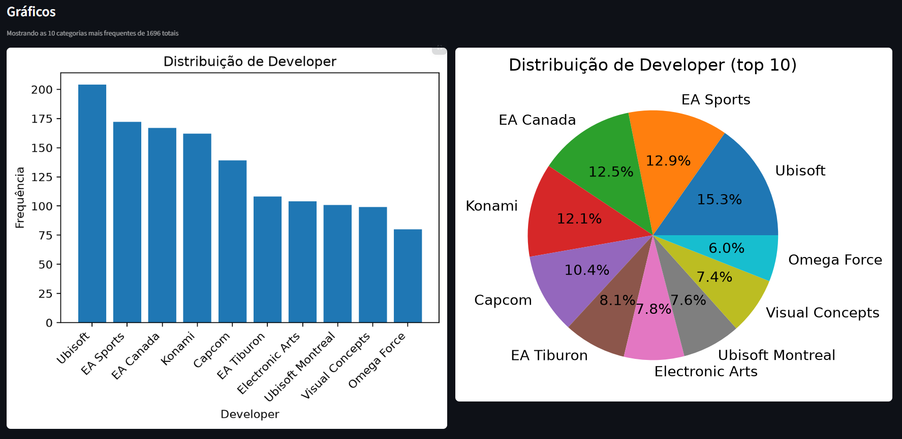
 
### Módulo 3: Probabilidade e Simulação (Monte Carlo)
 
Dois experimentos de simulação, com parâmetros controláveis pelo usuário via sliders:
 
- **Lei dos Grandes Números:** simulação de lançamentos de moeda (`random.random() < 0.5`), acompanhando a convergência da frequência relativa acumulada de "cara" para o valor teórico (0.5) conforme o número de lançamentos aumenta.
- **Teorema Central do Limite:** amostras aleatórias repetidas de uma variável numérica do dataset (`random.choices`), com a média de cada amostra calculada pela biblioteca própria. A distribuição dessas médias amostrais se aproxima de uma Normal conforme o tamanho da amostra aumenta, mesmo quando a variável original é assimétrica.
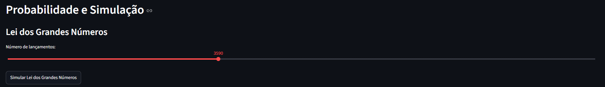
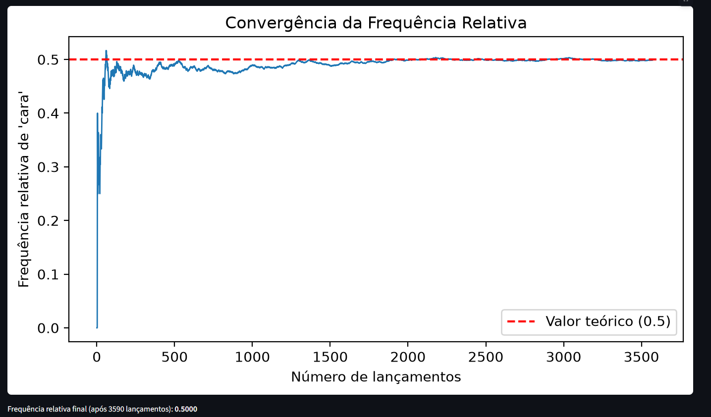
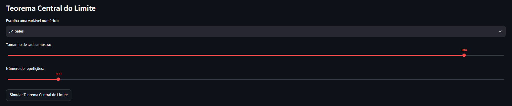
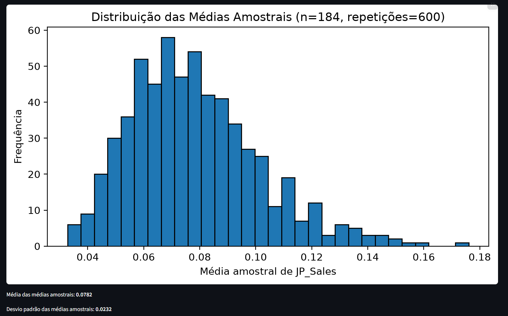
 
### Módulo 4: Distribuições Teóricas
 
Sobreposição de curvas de distribuições teóricas ao histograma (normalizado com `density=True`) de uma variável numérica, com parâmetros estimados a partir dos próprios dados: **Normal** (média e desvio padrão) e **Exponencial** (λ = 1/média). Permite comparar visualmente a qualidade do ajuste, por exemplo, a Normal se ajusta bem a `Critic_Score`, mas mal a `Global_Sales` (que é fortemente assimétrica), enquanto a Exponencial captura melhor o formato de `Global_Sales`.
 
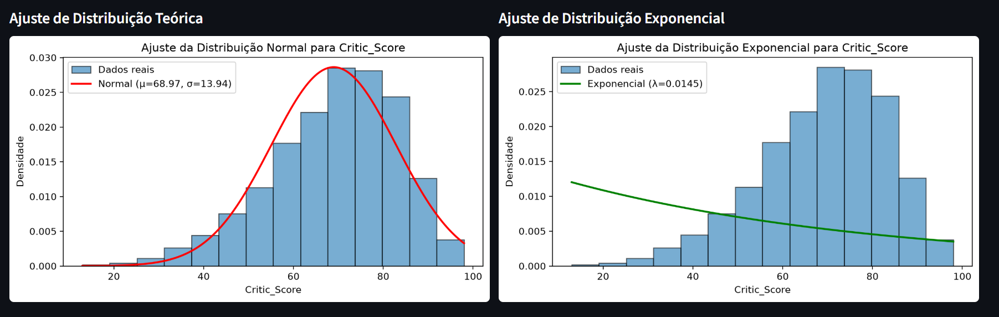
 
### Módulo 5: Correlação e Regressão Linear
 
O usuário escolhe duas variáveis numéricas (X e Y). A aplicação exibe o diagrama de dispersão com a reta de regressão sobreposta, calculada pelo método dos mínimos quadrados (implementado do zero, reaproveitando covariância e variância próprias), a equação da reta, o coeficiente de correlação de Pearson, R², interpretação textual dos coeficientes, um campo de predição interativa (o usuário digita um valor de X e recebe a previsão de Y), e um alerta destacando que correlação não implica causalidade.
 
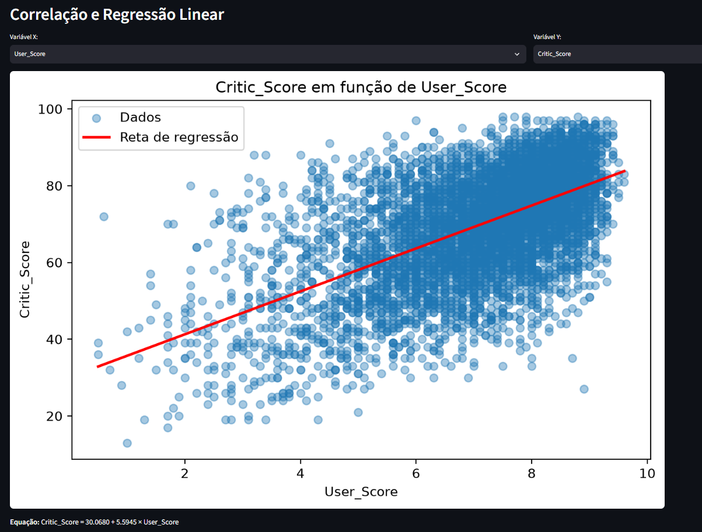
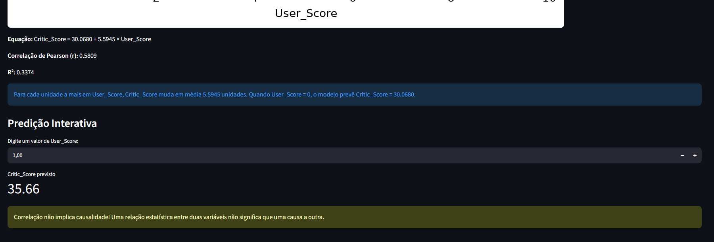

---
 
## 5. Descobertas (Módulo 6)
 
### Descoberta 1: Assimetria extrema das vendas
 
O histograma de `Global_Sales` revela uma distribuição fortemente assimétrica à direita, confirmada pela interpretação textual automática do app (média muito maior que a mediana). A regra do IQR detectou **1.892 outliers**, a maioria dos jogos vende pouco, enquanto uma pequena fração de sucessos gigantes (como Wii Sports) concentra a maior parte das vendas globais.
 
### Descoberta 2: Correlação fraca entre nota da crítica e vendas
 
Comparando `Critic_Score` e `Global_Sales` no Módulo 5, obtive **r = 0.2455** e **R² = 0.0603**, ou seja, a nota da crítica explica apenas 6% da variação nas vendas. Isso sugere que fatores como marketing, franquia estabelecida e plataforma pesam mais nas vendas do que a qualidade percebida pela crítica isoladamente.
 
### Descoberta 3: Crítica profissional e usuários concordam moderadamente, mas estão longe de serem a mesma coisa
 
Comparando `Critic_Score` com `User_Score`, a correlação de Pearson foi de **r = 0.5809** (moderada-forte, bem mais forte que a correlação nota-vendas vista na Descoberta 2), com **R² = 0.3374**, ou seja, cerca de 34% da variação na nota da crítica pode ser "explicada" pela nota dos usuários, através da equação `Critic_Score = 30.07 + 5.59 × User_Score`.
 
Isso sugere que crítica e usuários tendem a concordar na direção geral (jogos bem avaliados por um grupo tendem a ser bem avaliados pelo outro também), mas a relação está longe de ser perfeita, mais de 60% da variação na nota da crítica não é explicada pela nota dos usuários, indicando que os dois grupos frequentemente divergem em avaliações específicas.
 
---
 
## 6. Conclusão
 
A análise estatística do dataset "Video Game Sales with Ratings" revelou um mercado de jogos marcado por forte desigualdade: a maioria dos títulos vende pouco, enquanto uma pequena fração de sucessos gigantes concentra a maior parte das vendas globais (Descoberta 1), um padrão que a distribuição Exponencial captura bem melhor que a Normal (Módulo 4). Curiosamente, o sucesso de vendas está fracamente associado à qualidade percebida pela crítica especializada (Descoberta 2, R² = 0.06), sugerindo que fatores como marketing, franquia estabelecida e plataforma pesam mais nas vendas do que a nota da crítica isoladamente. Por outro lado, crítica e usuários concordam de forma moderada entre si (Descoberta 3, R² = 0.34) mais do que crítica e vendas, mas ainda longe de uma relação forte, o que indica que os dois grupos frequentemente avaliam os jogos por critérios distintos.
 
De forma mais ampla, o projeto demonstrou, na prática, conceitos centrais de estatística — desde medidas descritivas básicas até simulação de Monte Carlo, ajuste de distribuições teóricas e regressão linear, implementados e validados do zero, sem depender de funções prontas de bibliotecas externas para os cálculos centrais.
